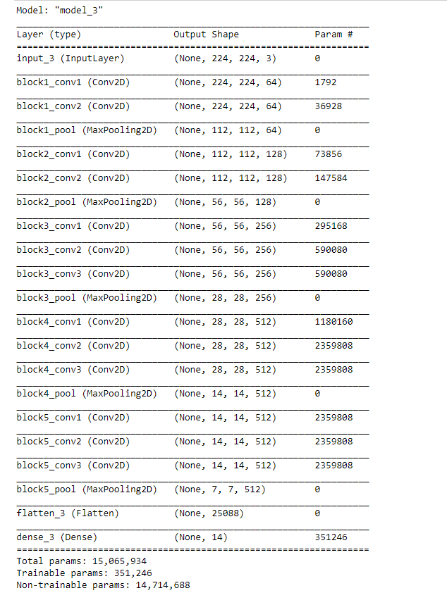

### VGG16 Using Tensorflow 

This is a Tensorflow implemention of VGG 16 and VGG 19 based on [tensorflow-vgg16](https://github.com/ry/tensorflow-vgg16). 
>To use the VGG networks, the npy files for [VGG16 NPY](https://mega.nz/#!YU1FWJrA!O1ywiCS2IiOlUCtCpI6HTJOMrneN-Qdv3ywQP5poecM) has to be downloaded.

## Usage
♻️ Use this to build the VGG object
```
vgg = vgg16.Vgg16()
vgg.build(images)
```
 ❗️ The `images` is a tensor with shape `[None, 224, 224, 3]`. 

A view from the project: 
